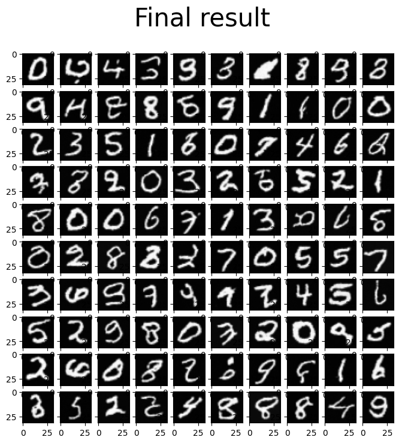
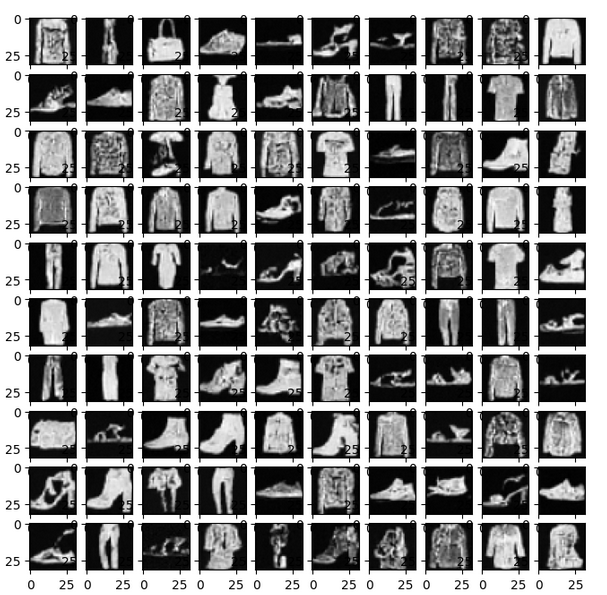

# Diffusion models

[](https://pypi.org/project/torch/2.1.2-/)
[](https://pypi.org/project/torchvision/0.16.2-/)
[](https://pypi.org/project/numpy/1.26.4/)

## Abstract

In this project, we explore the use of denoising diffusion probabilistic models (DDPMs) for image generation. DDPMs are a class of generative models that learn to reverse a diffusion process, gradually transforming a noisy image into a realistic one. Unlike other generative models such as GANs and VAEs, DDPMs do not require adversarial training or explicit likelihood estimation, making them easier to train and more stable.
We implement a DDPM model using PyTorch and train it on MNIST/FahionMNIST datasets.

## How to Use
To install the depedencies
```
pip install -r  requirements.txt
```
To train the model, run the following command:

```python
python train.py --size 32 num_blocks 2 --num_steps 10000
```
## Generated images



## Citation

```
@article{ho2020denoising,
  title={Denoising Diffusion Probabilistic Models},
  author={Jonathan Ho,Ajay Jain,Pieter Abbee},
  journal={arXiv preprint arXiv:2006.11239.},
  year={2020}
}
```
